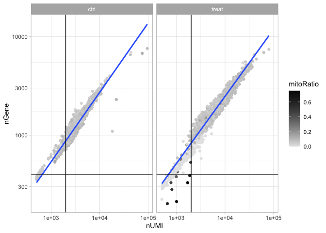
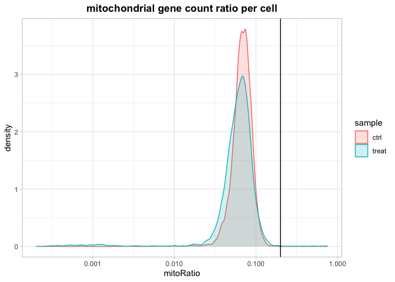

CLL\_sCRNASeq\_ver2
================
SR
2021-07-15

## Chronic lymphocytic leukemia single cell RNA-Seq data in two conditions: control & treatment.

The sample is primary CLL tumor from patient grown under two conditions:
control: includes fibroblasts and treatment: includes fibroblasts and
growth factor.

Some info on the 10X data from the two conditions can be found: \[link\]
\~/scRNASeq\_SR1/data/control/con1.html and here:\[link\]
\~/scRNASeq\_SR1/data/treat1/treat1.html. This includes summary and
analysis using Cellranger 6.0.1

## loading needed packages

## reading in data

The data provided is in the “data” folder in this project. Consists of 2
sub-folders representing the two conditions.

``` r
# load the cll_control data
cll_cntrl_data <- Read10X("~/scRNASeq_SR1/data/control/con1-filtered_feature_bc_matrix/")
# initializing the Seurat object with raw control data
cll_control <- CreateSeuratObject(counts = cll_cntrl_data, project = "cll_cntrl", min.cells = 3, min.features = 200)
cll_control
```

    ## An object of class Seurat 
    ## 16931 features across 6282 samples within 1 assay 
    ## Active assay: RNA (16931 features, 0 variable features)

``` r
# load the cll_treatment data
cll_treat1_data <- Read10X("~/scRNASeq_SR1/data/treat1/treat1-filtered_feature_bc_matrix/") # giving error when making github document
# initializing the Seurat object with raw treatment data (non-normalized)
cll_treatment <- CreateSeuratObject(counts = cll_treat1_data, project = "cll_treatment", min.cells = 3, min.features = 200)
cll_treatment
```

    ## An object of class Seurat 
    ## 16928 features across 4958 samples within 1 assay 
    ## Active assay: RNA (16928 features, 0 variable features)

The data provided is a “filtered\_feature\_bc\_matrix”. The
“raw\_feature\_bc\_matrix” has not been provided. Presumably, this data
was filtered by Cellranger once already.

*Instead of doing the refiltering separately on the control an treatment
objects, we will merge them and process them together. This assumes,
that the two objects are not subject to batch effects*

## Merging both seurat objects, QC visualization and filtering

``` r
# merging both seurat objects
merged_seurat <- merge(x = cll_control,
                       y = cll_treatment,
                       add.cell.id = c("cll_cntrl", "cll_treat"))
```

## Some data munging

``` r
# explore merged data
glimpse(merged_seurat@meta.data)
```

    ## Rows: 11,240
    ## Columns: 3
    ## $ orig.ident   <chr> "cll_cntrl", "cll_cntrl", "cll_cntrl", "cll_cntrl", "cll_…
    ## $ nCount_RNA   <dbl> 2866, 7543, 3981, 2571, 11056, 2680, 2767, 3816, 3006, 27…
    ## $ nFeature_RNA <int> 1176, 2476, 1473, 1103, 2964, 1326, 1151, 1444, 1318, 107…

there are 3 columns in the current object, we add two additional columns
: number of genes detected per UMI: this metric gives us an idea of the
complexity of our dataset (more genes detected per UMI, more complex our
data) mitochondrial ratio: this metric will give us a percentage of cell
reads originating from the mitochondrial genes

``` r
# add number of genes per UMI
merged_seurat$log10GenesPerUMI <- log10(merged_seurat$nFeature_RNA) /
  log10(merged_seurat$nCount_RNA)
```

``` r
# add the ratio of mitochondrial genes present
merged_seurat$mitoRatio <- PercentageFeatureSet(object = merged_seurat, pattern = "^MT-")
merged_seurat$mitoRatio <- merged_seurat$mitoRatio / 100
```

### additional metadata columns for convenience

``` r
# extracting metadata as a dataframe
metadata <- merged_seurat@meta.data
```

adding a new column for cell identifiers

This information is currently located in the row names of our metadata
dataframe. We will keep the rownames as is and duplicate it into a new
column called cells.

``` r
# add cell IDs to metadata
metadata$cells <- rownames(metadata)
```

Each cell ID has a cll\_cntrl\_ or cll\_treat\_ prefix as we had
specified when we merged the Seurat objects. We can use this prefix to
create a new column indicating which condition each cell is classified
under. We will call this column sample:

``` r
# create a column called sample
metadata$sample <- NA
metadata$sample[which(str_detect(metadata$cells, "^cll_cntrl_"))] <- "ctrl"
metadata$sample[which(str_detect(metadata$cells, "^cll_treat_"))] <- "treat"
```

rename some of the existing columns in metadata to be more intuitive:

``` r
# Rename columns
metadata <- metadata %>% 
  rename(seq_folder = orig.ident,
         nUMI = nCount_RNA,
         nGene = nFeature_RNA)
```

### saving new metadata into the merged seurat object

Before we assess our metrics we are going to save all of the work we
have done thus far back into our Seurat object. We simply assign the
dataframe into the meta.data slot:

``` r
# add metadata back to the merged seurat object
merged_seurat@meta.data <- metadata

# create a .RData object to load back at any time
# save(merged_seurat, file = "./data/cll_merged_filtered_seurat.RData") # commented out since already saved on macbookair
```

## Assessing QC metrics

### Note from the HBC scRNASeq tutorial:

We will assess various metrics and then decide on which cells are low
quality and should be removed from the analysis:

Cell counts, UMI counts per cell, Genes detected per cell, UMIs
vs. genes detected, Mitochondrial counts ratio, Novelty

What about doublets? In single-cell RNA sequencing experiments, doublets
are generated from two cells. They typically arise due to errors in cell
sorting or capture, especially in droplet-based protocols involving
thousands of cells. Doublets are obviously undesirable when the aim is
to characterize populations at the single-cell level. In particular,
they can incorrectly suggest the existence of intermediate populations
or transitory states that do not actually exist. Thus, it is desirable
to remove doublet libraries so that they do not compromise
interpretation of the results.

Why aren’t we checking for doublets? Many workflows use maximum
thresholds for UMIs or genes, with the idea that a much higher number of
reads or genes detected indicate multiple cells. While this rationale
seems to be intuitive, it is not accurate. Also, many of the tools used
to detect doublets tend to get rid of cells with intermediate or
continuous phenotypes, although they may work well on datasets with very
discrete cell types. We recommend not including any thresholds at this
point in time. When we have identified markers for each of the clusters,
we suggest exploring the markers to determine whether the markers apply
to more than one cell type.

### Cell counts

The cell counts are determined by the number of unique cellular barcodes
detected.

In an ideal world, you would expect the number of unique cellular
barcodes to correspond to the number of cells you loaded. However, this
is not the case as capture rates of cells are only a proportion of what
is loaded. For example, the inDrops cell capture efficiency is higher
(70-80%) compared to 10X which is between 50-60%.

NOTE: The capture efficiency could appear much lower if the cell
concentration used for library preparation was not accurate. Cell
concentration should NOT be determined by FACS machine or Bioanalyzer
(these tools are not accurate for concentration determination), instead
use a hemocytometer or automated cell counter for calculation of cell
concentration.

The cell numbers can also vary by protocol, producing cell numbers that
are much higher than what we loaded. For example, during the inDrops
protocol, the cellular barcodes are present in the hydrogels, which are
encapsulated in the droplets with a single cell and lysis/reaction
mixture. While each hydrogel should have a single cellular barcode
associated with it, occasionally a hydrogel can have more than one
cellular barcode. Similarly, with the 10X protocol there is a chance of
obtaining only a barcoded bead in the emulsion droplet (GEM) and no
actual cell. Both of these, in addition to the presence of dying cells
can lead to a higher number of cellular barcodes than cells.

``` r
# Visualize the number of cells in each sample
metadata %>% 
  ggplot() +
  geom_bar(aes(sample, fill = sample)) +
  theme_light() +
  theme(plot.title = element_text(hjust = 0.5, face = "bold")) +
  ggtitle("NCells")
```

<!-- -->

### UMI counts (transcripts) per cell

The UMI counts per cell should generally be above 500, that is the low
end of what we expect. If UMI counts are between 500-1000 counts, it is
usable but the cells probably should have been sequenced more deeply.

``` r
# visualize the number of transcripts (UMIs) per cell
metadata %>% 
  ggplot(aes(x = nUMI, color = sample, fill = sample)) +
  geom_density(alpha = 2/10) +
  theme_light() + 
  scale_x_log10() + 
  ylab("cell density") + 
  geom_vline(xintercept = 500) +
  theme(plot.title = element_text(hjust = 0.5, face = "bold")) + 
  ggtitle("transcripts per cell")
```

<!-- -->

Unless a batch effect, clearly the two populations of cells in the two
conditions are distinct, perhaps the “treatment” population exists in
the control sample as a small fraction; small peak that appears right
below the main peak of “treatment”.

### Gene counts per cell

We have similar expectations for gene detection as for UMI detection,
although it may be a bit lower than UMIs. For high quality data, the
proportional histogram should contain a single large peak that
represents cells that were encapsulated. If we see a small shoulder to
the left of the major peak (not present in our data), or a bimodal
distribution of the cells, that can indicate a couple of things. It
might be that there are a set of cells that failed for some reason. It
could also be that there are biologically different types of cells
(i.e. quiescent cell populations, less complex cells of interest),
and/or one type is much smaller than the other (i.e. cells with high
counts may be cells that are larger in size).

``` r
# visualize number of genes (nGene) per cell with a histogram
metadata %>% 
  ggplot(aes(nGene, color = sample, fill = sample)) +
  geom_density(alpha = 2/10) + 
  theme_light() + 
  scale_x_log10() + 
  geom_vline(xintercept = 300) + 
  theme(plot.title = element_text(hjust = 0.5, face = "bold")) + 
  ggtitle("genes per cell")
```

<!-- -->

``` r
# visualize number of genes as a boxplot
metadata %>% 
  ggplot(aes(x = sample, y = log10(nGene), fill = sample)) + 
  geom_boxplot(alpha = 5/10) + 
  theme_light() + 
  theme(plot.title = element_text(hjust = 0.5, face = "bold")) + 
  ggtitle("genes per cell")
```

<!-- -->

Again, we see a distinct second peak in the control condition which is
to the *left* of the main peak and superimposed with the “treatment’
peak. Perhaps there are secondary peaks in the”treatment" condition also
to the *left* of the treatment main peak.

Also, there could be small but distinct peaks to the *right* of both
main peaks suggestive of cells that failed or have much fewer genes
(fibroblasts?)

## Genes versus UMIs detected

``` r
# scatter plot of UMIs versus genes detected per cell colored by ratio of mitochondrial genes
metadata %>% 
  ggplot(aes(x = nUMI, y = nGene, color = mitoRatio)) +
  geom_jitter() +
  scale_color_gradient(low = "gray90", high = "black") +
  stat_smooth(method = lm) +
  scale_x_log10() +
  scale_y_log10() +
  theme_light() + 
  geom_vline(xintercept = 2000) +
  geom_hline(yintercept = 400) + 
  facet_wrap(~sample)
```

    ## `geom_smooth()` using formula 'y ~ x'

<!-- -->

Here, we have plotted the number of genes versus the number of UMIs
colored by the fraction of mitochondrial reads. Mitochondrial read
fractions are only high in particularly low count cells with few
detected genes (darker colored data points). This could be indicative of
damaged/dying cells whose cytoplasmic mRNA has leaked out through a
broken membrane, and thus, only mRNA located in the mitochondria is
still conserved. These cells are filtered out by our count and gene
number thresholds. Jointly visualizing the count and gene thresholds
shows the joint filtering effect.

Cells that are poor quality are likely to have low genes and UMIs per
cell, and correspond to the data points in the bottom left quadrant of
the plot. Good cells will generally exhibit both higher number of genes
per cell and higher numbers of UMIs.

## Mitochondrial gene counts

This metric can identify whether there is a large amount of
mitochondrial contamination from dead or dying cells.We define poor
quality samples for mitochondrial counts as cells which surpass the 0.2
mitochondrial ratio mark, unless of course you are expecting this in
your sample.

``` r
# visualizing mitochondrial genes per cell 
metadata %>% 
  ggplot(aes(mitoRatio, color = sample, fill = sample)) + 
  geom_density(alpha = 2/10) + 
  theme_light() + 
  scale_x_log10() + 
  geom_vline(xintercept = 0.2) + 
  theme(plot.title = element_text(hjust = 0.5, face = "bold")) + 
  ggtitle("mitochondrial gene count ratio per cell")
```

    ## Warning: Transformation introduced infinite values in continuous x-axis

    ## Warning: Removed 77 rows containing non-finite values (stat_density).

<!-- -->

## Complexity

We can evaluate each cell in terms of how complex the RNA species are by
using a measure called the novelty score. The novelty score is computed
by taking the ratio of nGenes over nUMI. If there are many captured
transcripts (high nUMI) and a low number of genes detected in a cell,
this likely means that you only captured a low number of genes and
simply sequenced transcripts from those lower number of genes over and
over again. These low complexity (low novelty) cells could represent a
specific cell type (i.e. red blood cells which lack a typical
transcriptome), or could be due to some other strange artifact or
contamination. Generally, we expect the novelty score to be above 0.80
for good quality cells.

``` r
# visualizing genes per UMI to assess complexity
metadata %>% 
  ggplot(aes(log10GenesPerUMI, color = sample, fill = sample)) + 
  geom_density(alpha = 2/10) + 
  theme_light()+
  scale_x_log10() + 
  geom_vline(xintercept = 0.8) + 
  theme(plot.title = element_text(hjust = 0.5, face = "bold")) + 
  ggtitle("genes per UMI")
```

<!-- -->

## Cell filtering

Based on above analysis, we will use foll; thresholds: nUMI &gt; 2000,
nGene &gt; 400, mitoRatio &lt; 0.2, log10GeneperUMI &gt; 0.8

``` r
# filtering out low quality cells based on selected thresholds
filtered_seurat <- subset(x = merged_seurat,
                          subset = (nUMI >= 2000) & 
                            (nGene >= 400) & 
                            (log10GenesPerUMI > 0.8) &
                            (mitoRatio < 0.2))
```

## Gene-level filtering

Within our data we will have many genes with zero counts. These genes
can dramatically reduce the average expression for a cell and so we will
remove them from our data. We will start by identifying which genes have
a zero count in each cell:

``` r
# Extract counts
counts <- GetAssayData(object = filtered_seurat, slot = "counts")

# Output a logical matrix specifying for each gene on whether or not there are more than zero counts per cell
nonzero <- counts > 0
```

Now, we will perform some filtering by prevalence. If a gene is only
expressed in a handful of cells, it is not particularly meaningful as it
still brings down the averages for all other cells it is not expressed
in. For our data we choose to keep only genes which are expressed in 10
or more cells. By using this filter, genes which have zero counts in all
cells will effectively be removed.

``` r
# Sums all TRUE values and returns TRUE if more than 10 TRUE values per gene
keep_genes <- Matrix::rowSums(nonzero) >= 10

# Only keeping those genes expressed in more than 10 cells
filtered_counts <- counts[keep_genes, ]
```

Finally, take those filtered counts and create a new Seurat object for
downstream analysis.

``` r
# Reassign to filtered Seurat object
filtered_seurat <- CreateSeuratObject(filtered_counts, meta.data = filtered_seurat@meta.data)
```

## Reassessing QC metrics

``` r
# extracting metadata as a dataframe from the filtered_seurat object
filtered_metadata <- filtered_seurat@meta.data
```

``` r
# Visualize the number of cells in each sample
filtered_metadata %>% 
  ggplot() +
  geom_bar(aes(sample, fill = sample)) +
  theme_light() +
  theme(plot.title = element_text(hjust = 0.5, face = "bold")) +
  ggtitle("NCells")
```

<!-- -->

``` r
# visualize the number of transcripts (UMIs) per cell
filtered_metadata %>% 
  ggplot(aes(x = nUMI, color = sample, fill = sample)) +
  geom_density(alpha = 2/10) +
  theme_light() + 
  scale_x_log10() + 
  ylab("cell density") + 
  geom_vline(xintercept = 500) +
  theme(plot.title = element_text(hjust = 0.5, face = "bold")) + 
  ggtitle("transcripts per cell")
```

<!-- -->

``` r
# visualize number of genes (nGene) per cell with a histogram
filtered_metadata %>% 
  ggplot(aes(nGene, color = sample, fill = sample)) +
  geom_density(alpha = 2/10) + 
  theme_light() + 
  scale_x_log10() + 
  geom_vline(xintercept = 300) + 
  theme(plot.title = element_text(hjust = 0.5, face = "bold")) + 
  ggtitle("genes per cell")
```

<!-- -->

``` r
# visualize number of genes as a boxplot
filtered_metadata %>% 
  ggplot(aes(x = sample, y = log10(nGene), fill = sample)) + 
  geom_boxplot(alpha = 5/10) + 
  theme_light() + 
  theme(plot.title = element_text(hjust = 0.5, face = "bold")) + 
  ggtitle("genes per cell")
```

<!-- -->

``` r
# scatter plot of UMIs versus genes detected per cell colored by ratio of mitochondrial genes
filtered_metadata %>% 
  ggplot(aes(x = nUMI, y = nGene, color = mitoRatio)) +
  geom_jitter() +
  scale_color_gradient(low = "gray90", high = "black") +
  stat_smooth(method = lm) +
  scale_x_log10() +
  scale_y_log10() +
  theme_light() + 
  geom_vline(xintercept = 2000) +
  geom_hline(yintercept = 400) + 
  facet_wrap(~sample)
```

    ## `geom_smooth()` using formula 'y ~ x'

<!-- -->

``` r
# visualizing mitochondrial genes per cell 
filtered_metadata %>% 
  ggplot(aes(mitoRatio, color = sample, fill = sample)) + 
  geom_density(alpha = 2/10) + 
  theme_light() + 
  scale_x_log10() + 
  geom_vline(xintercept = 0.2) +
  theme(plot.title = element_text(hjust = 0.5, face = "bold")) + 
  ggtitle("mitochondrial gene count ratio per cell")
```

    ## Warning: Transformation introduced infinite values in continuous x-axis

    ## Warning: Removed 18 rows containing non-finite values (stat_density).

<!-- -->

``` r
# visualizing genes per UMI to assess complexity
filtered_metadata %>% 
  ggplot(aes(log10GenesPerUMI, color = sample, fill = sample)) + 
  geom_density(alpha = 2/10) + 
  theme_light()+
  scale_x_log10() + 
  geom_vline(xintercept = 0.8) +
  theme(plot.title = element_text(hjust = 0.5, face = "bold")) + 
  ggtitle("genes per UMI")
```

<!-- -->

## Saving the filtered cells

``` r
# Create .RData object to load at any time
#nsave(filtered_seurat, file="./data/seurat_filtered.RData") # commented out since already saved on macbookair
```
